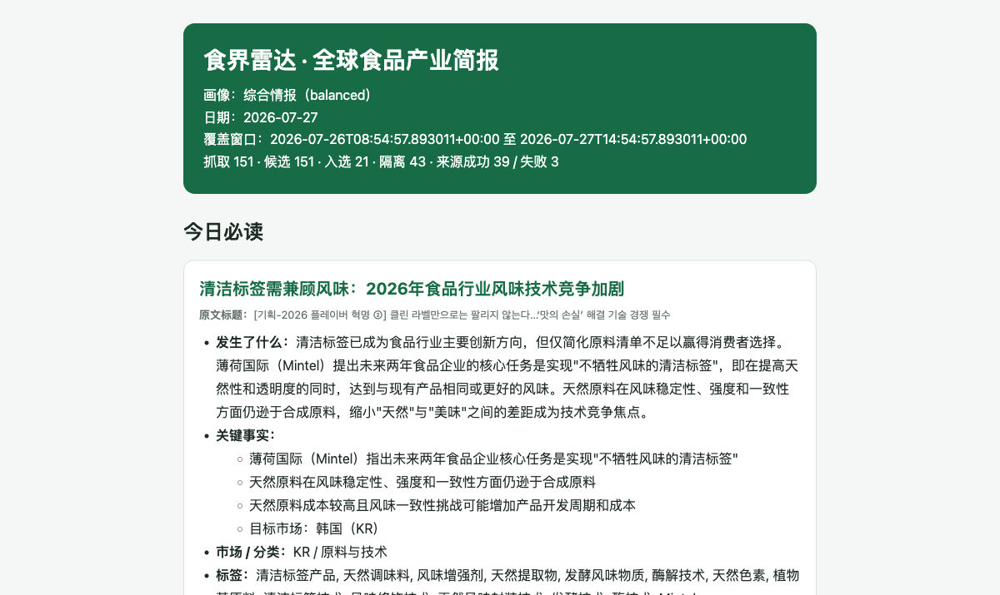

# FoodScope

An AI-powered, self-hosted intelligence radar for the food industry. FoodScope collects industry signals, removes duplicates, evaluates evidence, analyzes relevance, and produces structured briefings in Markdown and HTML.

[简体中文](README_zh.md) · [Live briefing example](https://meng1986290016-hub.github.io/FoodScope/foodscope/example-brief.html) · [Configuration](docs/foodscope/configuration.md) · [Source packs](docs/foodscope/source-packs.md) · [Operations](docs/foodscope/operations.md)

> New to Python? Follow the Quick Start in order. It takes you from a fresh machine to your first local briefing without enabling email, Feishu, WeChat, or any other external delivery.

## What FoodScope does

FoodScope helps teams monitor:

- food and beverage launches, brands, and market activity;
- ingredients, formulations, nutrition, and R&D;
- food safety, regulation, recalls, and compliance;
- packaging, processing, retail, and foodservice;
- China, Southeast Asia, Japan, Korea, and global markets.

Each run:

1. Fetches content from the configured sources.
2. Resolves original URLs and merges duplicate events across languages.
3. Uses AI to evaluate food relevance, importance, and evidence quality.
4. Selects findings for a market, product, R&D, compliance, or balanced profile.
5. Writes an auditable run archive under `data/runs/<run-id>/`.
6. Optionally delivers the briefing through Feishu/Lark, email, WeChat drafts, or a generic webhook.

This screenshot comes from a real FoodScope run:

[](https://meng1986290016-hub.github.io/FoodScope/foodscope/example-brief.html)

Click the image to open the complete HTML briefing.

## Quick Start

The first run below is deliberately local-only: it creates an archive but sends nothing externally.

### 1. Install the prerequisites

You need:

- Windows, macOS, or Linux with internet access;
- Git;
- Python 3.11 or later;
- [uv](https://docs.astral.sh/uv/);
- an API key for at least one supported AI provider.

Check Git and Python:

```bash
git --version
python3 --version
```

Install uv on macOS or Linux:

```bash
curl -LsSf https://astral.sh/uv/install.sh | sh
```

Install uv in Windows PowerShell:

```powershell
powershell -ExecutionPolicy ByPass -c "irm https://astral.sh/uv/install.ps1 | iex"
```

Open a new terminal and verify the installation:

```bash
uv --version
```

### 2. Download FoodScope

```bash
git clone https://github.com/meng1986290016-hub/FoodScope.git
cd FoodScope
```

You can also use **Code → Download ZIP** on GitHub. Extract the archive, open a terminal in that directory, and make sure you can see `pyproject.toml` and the `data` directory.

### 3. Install the project

```bash
uv sync
```

uv creates an isolated Python environment automatically. You do not need to activate a virtual environment or run `pip install`.

### 4. Create local configuration

macOS or Linux:

```bash
cp data/config.foodscope.example.json data/config.json
cp .env.example .env
```

Windows PowerShell:

```powershell
Copy-Item data/config.foodscope.example.json data/config.json
Copy-Item .env.example .env
```

The files have different roles:

| File | Purpose | Commit to Git? |
| --- | --- | --- |
| `data/config.json` | Models, source packs, profile, schedule, and delivery settings | Review before committing |
| `.env` | API keys, webhook URLs, and passwords | Never |

### 5. Configure an AI provider

DeepSeek is used here as a simple example. Add your key to `.env`:

```dotenv
DEEPSEEK_API_KEY=replace_with_your_key
```

In `data/config.json`, change the `provider`, `model`, and `api_key_env` fields under all three locations:

- `ai`
- `ai_routes.fast`
- `ai_routes.analysis`

Use:

```json
{
  "provider": "deepseek",
  "model": "deepseek-chat",
  "api_key_env": "DEEPSEEK_API_KEY"
}
```

Keep the surrounding fields such as `languages`, `concurrency`, and `timeout_seconds`; replace only the three fields shown above.

Supported providers include:

| Platform | `provider` | Starter model | Environment variable |
| --- | --- | --- | --- |
| OpenAI | `openai` | `gpt-4o-mini` | `OPENAI_API_KEY` |
| Anthropic | `anthropic` | an available Claude model | `ANTHROPIC_API_KEY` |
| Google Gemini | `gemini` | an available Gemini Flash model | `GOOGLE_API_KEY` |
| DeepSeek | `deepseek` | `deepseek-chat` | `DEEPSEEK_API_KEY` |
| Moonshot Kimi | `kimi` | `kimi-k2.6` | `KIMI_API_KEY` |
| Alibaba DashScope | `ali` | `qwen-plus` | `DASHSCOPE_API_KEY` |
| ByteDance Doubao | `doubao` | your Ark endpoint ID | `DOUBAO_API_KEY` |
| MiniMax | `minimax` | `MiniMax-M3` | `MINIMAX_API_KEY` |
| Zhipu GLM | `zhipu` | `glm-5.2` | `ZHIPU_API_KEY` |
| Baidu Qianfan | `qianfan` | `ernie-4.5-turbo-20260402` | `QIANFAN_API_KEY` |
| Tencent Hunyuan | `hunyuan` | `hunyuan-turbos-latest` | `HUNYUAN_API_KEY` |
| SiliconFlow | `siliconflow` | `Pro/zai-org/GLM-4.7` | `SILICONFLOW_API_KEY` |
| Azure OpenAI | `azure` | your deployment name | `AZURE_OPENAI_API_KEY` |
| Ollama | `ollama` | your local model | no key required |

Model availability changes over time and may vary by account. If a provider reports that a model does not exist or is unavailable, copy an accessible model ID from that provider's console into `model`.

> `api_key_env` contains the name of an environment variable, not the secret itself. Real keys belong only in `.env`.

### 6. Run FoodScope

```bash
uv run python -m src.main --no-deliver
```

`--no-deliver` generates and archives the briefing without sending messages or email.

The first run may take several minutes depending on source count, network conditions, and model speed. The run is complete when the terminal returns to the prompt without a `Fatal error`.

### 7. Open the result

Every run has its own directory:

```text
data/runs/<run-id>/
├── manifest.json
├── raw.json
├── normalized.json
├── scored.json
├── filtered.json
├── enriched.json
├── facts.json
├── brief.md
└── brief.html
```

Open `brief.html` from the newest directory in a browser, or open `brief.md` in a text editor. You now have a working local FoodScope installation.

## Common commands

```bash
# Safe local run
uv run python -m src.main --no-deliver

# Analyze the last 48 hours
uv run python -m src.main --hours 48 --no-deliver

# Run and use enabled delivery channels
uv run python -m src.main

# Run continuously using the configured cron schedule
uv run python -m src.main --daemon

# Validate configuration and scheduled-run freshness
uv run python -m src.main --healthcheck

# Resume the latest incomplete run
uv run python -m src.main --resume latest --no-deliver

# Show every CLI option
uv run python -m src.main --help
```

## Briefing profiles

Set the active profile in `data/config.json`:

```json
{
  "foodscope": {
    "enabled": true,
    "profile": "balanced"
  }
}
```

| Profile | Intended audience | Emphasis |
| --- | --- | --- |
| `balanced` | Leaders and general intelligence teams | Balanced market, product, R&D, and compliance coverage |
| `market` | Strategy, brand, and market teams | Companies, channels, consumers, and market change |
| `new_products` | Product and innovation teams | Launches, flavors, categories, and brand activity |
| `rd` | R&D, ingredient, and formulation teams | Ingredients, processing, nutrition, and research |
| `compliance` | Regulatory, quality, and safety teams | Regulation, recalls, risk, and official evidence |

See [Briefing profiles](docs/foodscope/profiles.md) for details.

## Source packs

Source packs group curated sources by topic or market:

```json
{
  "foodscope": {
    "source_packs": [
      "official_evidence",
      "global_industry",
      "product_launches",
      "discovery_queries"
    ]
  }
}
```

| Source pack | Coverage |
| --- | --- |
| `official_evidence` | Regulators, official announcements, and primary evidence |
| `global_industry` | Global food industry publications |
| `product_launches` | Food and beverage launches |
| `ingredients_rd` | Ingredients, nutrition, and R&D |
| `packaging_processing` | Packaging and processing |
| `retail_foodservice` | Retail and foodservice |
| `research_data` | Research and industry data |
| `southeast_asia` | Southeast Asian markets |
| `japan` | Japan |
| `korea` | Korea |
| `discovery_queries` | Multilingual discovery queries |
| `x_watch` | Curated official X/Twitter accounts |

Start with the example configuration, verify a stable run, and add packs gradually. See [Source packs](docs/foodscope/source-packs.md) for the full catalog.

## Docker

### Prepare configuration

```bash
cp data/config.foodscope.example.json data/config.json
cp .env.example .env
```

Configure `.env` and all three AI locations as described above.

### Build and test

```bash
docker compose build
docker compose run --rm foodscope uv run python -m src.main --no-deliver
```

### Start scheduled operation

```bash
docker compose up -d
```

View logs:

```bash
docker compose logs -f foodscope
```

Stop the service:

```bash
docker compose down
```

The host `data` directory is mounted into the container, so recreating the container does not remove run archives.

## Scheduling

Configure the timezone and five-field cron expression:

```json
{
  "schedule": {
    "timezone": "Asia/Shanghai",
    "cron": "30 6 * * *"
  }
}
```

This example runs every day at 06:30 in Shanghai time.

Run locally:

```bash
uv run python -m src.main --daemon
```

For long-running deployments, Docker is usually simpler:

```bash
docker compose up -d
```

## Delivery

Keep delivery disabled during setup and validate the output with `--no-deliver` first. After reviewing the generated briefing, enable channels one at a time:

- Feishu/Lark and generic webhooks: [FoodScope configuration](docs/foodscope/configuration.md)
- Email: [General configuration](docs/configuration.md)
- WeChat Official Account drafts: [Operations](docs/foodscope/operations.md)

Store webhook URLs, API keys, and email passwords in `.env`, never directly in `data/config.json`.

## Troubleshooting

### `uv: command not found`

Open a new terminal after installing uv. If it is still missing, follow the uv installation guide to add the installation directory to `PATH`.

### `data/config.json` is missing

Run from the repository root:

```bash
cp data/config.foodscope.example.json data/config.json
```

### `Missing API key`

Check that:

1. `.env` exists in the repository root;
2. the correct key is present in `.env`;
3. every `api_key_env` exactly matches the variable name in `.env`;
4. you did not put the secret value itself inside `api_key_env`.

### The model does not exist or access is denied

Open the provider console and copy an available model ID into the corresponding `model` field in `data/config.json`.

### The run succeeds but selects no findings

This can be a valid result. The time window may contain too little new material, or candidates may fail relevance and evidence checks.

Try a longer lookback:

```bash
uv run python -m src.main --hours 72 --no-deliver
```

Also inspect `manifest.json` and `raw.json` in the newest run directory, and verify that `evidence.mode` is set to `loose` while you are evaluating the system.

### Some sources are unavailable

FoodScope isolates individual source failures and continues the run. Temporarily remove consistently inaccessible source packs, then use [Operations](docs/foodscope/operations.md) for deeper diagnostics.

### Docker keeps restarting

```bash
docker compose logs --tail=200 foodscope
```

Check `.env`, `data/config.json`, API credentials, and JSON syntax first.

## Project layout

```text
.
├── src/foodscope/                 # Food intelligence workflow
├── data/
│   ├── config.foodscope.example.json
│   ├── foodscope/source_packs/    # Curated source packs
│   ├── foodscope/profiles/        # Briefing profiles
│   └── runs/                      # Local run archives
├── docs/foodscope/                # FoodScope documentation
├── tests/                         # Automated tests
├── .env.example
├── docker-compose.yml
└── pyproject.toml
```

## Advanced capabilities

- independent fast and analysis model routes;
- provider fallback chains;
- resumable runs and safe redelivery;
- source health and fetch reports;
- Feishu, email, WeChat draft, and webhook delivery;
- MCP integration;
- configurable evidence admission;
- custom source packs and briefing profiles.

Documentation:

| Document | Covers |
| --- | --- |
| [FoodScope configuration](docs/foodscope/configuration.md) | AI routes, scheduling, evidence, and delivery |
| [Source packs](docs/foodscope/source-packs.md) | Source coverage and customization |
| [Profiles](docs/foodscope/profiles.md) | Market, product, R&D, and compliance profiles |
| [Operations](docs/foodscope/operations.md) | Scheduling, recovery, redelivery, and troubleshooting |
| [Contributing to FoodScope](docs/foodscope/contributing.md) | Adding sources and contributing code |
| [General configuration](docs/configuration.md) | Base Horizon capabilities and providers |
| [MCP tools](src/mcp/README.md) | Accessing the pipeline through MCP |

## Development

```bash
uv sync --extra dev
uv run pytest
uv run ruff check .
```

Optional integrations:

```bash
# OpenBB financial news
uv sync --extra openbb

# Browser-based X/Twitter collection
uv sync --extra twitter

# Enhanced full-text extraction
uv sync --extra trafilatura
```

## Contributing

Issues, pull requests, reliable sources, and new food-industry source packs are welcome. Read [CONTRIBUTING.md](CONTRIBUTING.md) and the [FoodScope contribution guide](docs/foodscope/contributing.md) before submitting changes.

## Upstream

FoodScope extends [Horizon](https://github.com/Thysrael/Horizon). See [UPSTREAM.md](UPSTREAM.md) for the upstream relationship and synchronization policy.

## License

[MIT](LICENSE)
