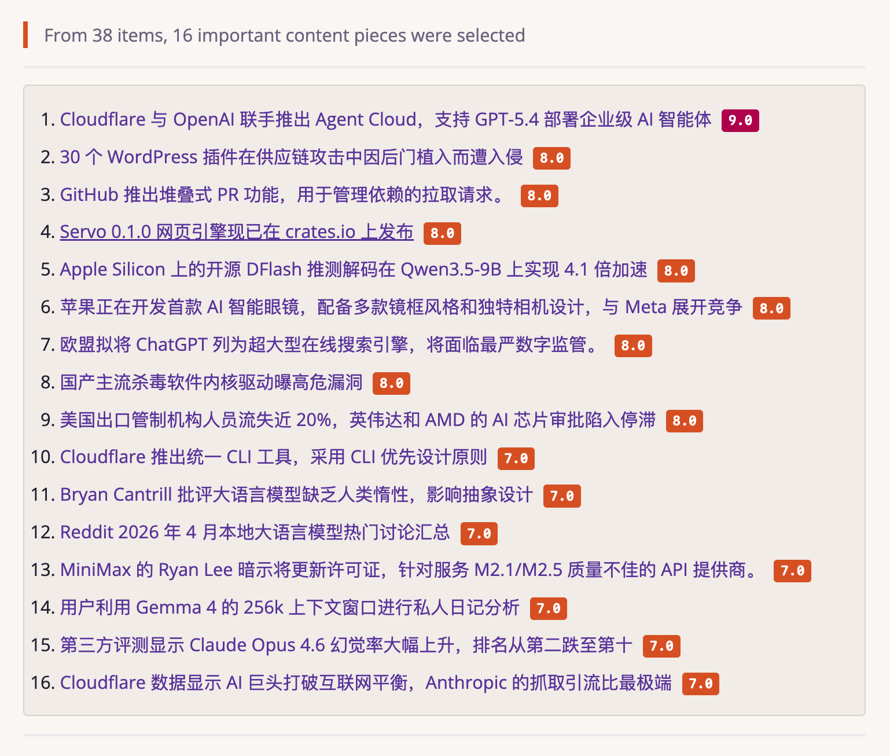

# 食界雷达（FoodScope）

面向食品行业的 AI 情报雷达：自动收集行业信息、去重、分析、筛选，并生成中文简报。

[English](README.md) · [完整配置](docs/foodscope/configuration.md) · [来源包](docs/foodscope/source-packs.md) · [运行与恢复](docs/foodscope/operations.md)

> 没有 Python 基础也可以部署。第一次使用建议严格按照下方“零基础快速开始”操作，先在本机生成一份简报，再考虑定时运行和消息推送。

## 它能做什么

FoodScope 可以帮助你持续关注：

- 食品饮料新品、品牌与市场动态
- 原料、配方、营养与研发趋势
- 食品安全、法规与合规变化
- 包装、加工、零售和餐饮行业动态
- 中国、东南亚、日韩及全球食品市场

一次运行会依次完成：

1. 从配置的信息源抓取内容。
2. 合并重复新闻并识别原始出处。
3. 使用大模型判断食品行业相关性、重要程度和证据质量。
4. 按所选画像筛选市场、新品、研发或合规信息。
5. 在 `data/runs/<运行编号>/` 中生成 Markdown 和 HTML 简报。
6. 根据配置选择性发送到飞书、邮件或微信公众号草稿箱。



## 零基础快速开始

下面先完成最安全的本地试运行：不启动定时任务，也不向外发送任何消息。

### 第 1 步：准备环境

需要：

- 一台可以联网的 Windows、macOS 或 Linux 电脑
- Git
- Python 3.11 或更高版本
- uv（Python 项目管理工具）
- 至少一个大模型 API Key

检查 Git 和 Python 是否已经安装：

```bash
git --version
python3 --version
```

安装 uv：

```bash
# macOS / Linux
curl -LsSf https://astral.sh/uv/install.sh | sh
```

Windows PowerShell：

```powershell
powershell -ExecutionPolicy ByPass -c "irm https://astral.sh/uv/install.ps1 | iex"
```

安装后关闭并重新打开终端，再检查：

```bash
uv --version
```

### 第 2 步：下载项目

在当前仓库页面点击 **Code → HTTPS**，复制显示的仓库地址，然后执行：

```bash
git clone 复制到的仓库地址 FoodScope
cd FoodScope
```

例如，复制到的地址如果是 `https://github.com/your-name/foodscope.git`，完整命令就是：

```bash
git clone https://github.com/your-name/foodscope.git FoodScope
cd FoodScope
```

也可以在仓库页面选择 **Download ZIP**，解压后在终端进入解压目录。后续命令都要在项目根目录执行，也就是能看到 `pyproject.toml` 和 `data` 文件夹的位置。

### 第 3 步：安装依赖

```bash
uv sync
```

uv 会自动创建隔离的 Python 环境，不需要手动执行 `pip install` 或激活虚拟环境。

### 第 4 步：创建配置文件

复制 FoodScope 示例配置和环境变量模板：

```bash
cp data/config.foodscope.example.json data/config.json
cp .env.example .env
```

Windows PowerShell：

```powershell
Copy-Item data/config.foodscope.example.json data/config.json
Copy-Item .env.example .env
```

这两个文件的作用不同：

| 文件 | 保存什么 | 能否提交到 Git |
| --- | --- | --- |
| `data/config.json` | 模型名称、信息源、画像、运行和分发设置 | 可以，但提交前仍建议检查 |
| `.env` | API Key、邮箱密码等秘密 | 不可以 |

### 第 5 步：选择大模型

国内用户可优先选择 DeepSeek、Kimi、通义千问、智谱 GLM、百度千帆、腾讯混元或硅基流动。

以下以 DeepSeek 为例。

打开 `.env`，填写：

```dotenv
DEEPSEEK_API_KEY=替换成你自己的API_Key
```

然后打开 `data/config.json`，把 `ai`、`ai_routes.fast` 和 `ai_routes.analysis` 三处模型配置都改成：

```json
{
  "provider": "deepseek",
  "model": "deepseek-chat",
  "api_key_env": "DEEPSEEK_API_KEY"
}
```

`data/config.json` 中必须保留原有的其他字段，例如 `languages`、`concurrency` 和 `timeout_seconds`。只替换上述三个字段，不要把整份配置删掉。

其他国内模型的配置如下：

| 平台 | `provider` | 推荐起步模型 | `.env` 中的变量 |
| --- | --- | --- | --- |
| DeepSeek | `deepseek` | `deepseek-chat` | `DEEPSEEK_API_KEY` |
| Kimi | `kimi` | `kimi-k2.6` | `KIMI_API_KEY` |
| 阿里云百炼 | `ali` | `qwen-plus` | `DASHSCOPE_API_KEY` |
| 火山引擎豆包 | `doubao` | 你的方舟 Endpoint ID | `DOUBAO_API_KEY` |
| MiniMax | `minimax` | `MiniMax-M3` | `MINIMAX_API_KEY` |
| 智谱 GLM | `zhipu` | `glm-5.2` | `ZHIPU_API_KEY` |
| 百度千帆 | `qianfan` | `ernie-4.5-turbo-20260402` | `QIANFAN_API_KEY` |
| 腾讯混元 | `hunyuan` | `hunyuan-turbos-latest` | `HUNYUAN_API_KEY` |
| 硅基流动 | `siliconflow` | `Pro/zai-org/GLM-4.7` | `SILICONFLOW_API_KEY` |

模型可能随平台调整。如果提示“模型不存在”或“无权限”，请到对应平台控制台查看当前账号可用的模型 ID，并修改 `model`。

> `api_key_env` 填的是环境变量名称，例如 `DEEPSEEK_API_KEY`，不是 API Key 本身。真实密钥只填写在 `.env` 中。

### 第 6 步：执行第一次试运行

```bash
uv run python -m src.main --no-deliver
```

`--no-deliver` 表示只生成并保存简报，不发送邮件、飞书或微信消息。

首次运行需要抓取和分析较多内容，耗时取决于网络、信息源数量和模型速度。终端回到命令提示符且没有出现 `Fatal error`，表示运行结束。

### 第 7 步：查看结果

每次运行会生成一个独立目录：

```text
data/runs/<运行编号>/
├── manifest.json    # 本次运行状态和统计
├── raw.json         # 原始抓取结果
├── brief.md         # Markdown 简报
└── brief.html       # 浏览器可打开的 HTML 简报
```

找到 `data/runs` 中最新的文件夹，用浏览器打开 `brief.html`，或用文本编辑器打开 `brief.md`。

到这里，你已经完成了 FoodScope 的本地搭建。

## 常用命令

```bash
# 安全试运行，不向外发送
uv run python -m src.main --no-deliver

# 抓取最近 48 小时
uv run python -m src.main --hours 48 --no-deliver

# 按配置正常运行，并执行已启用的分发
uv run python -m src.main

# 按 data/config.json 中的 cron 长期运行
uv run python -m src.main --daemon

# 检查配置和定时任务健康状态
uv run python -m src.main --healthcheck

# 恢复最近一次未完成的运行
uv run python -m src.main --resume latest --no-deliver

# 查看所有命令参数
uv run python -m src.main --help
```

## 选择适合你的简报画像

在 `data/config.json` 中修改：

```json
{
  "foodscope": {
    "enabled": true,
    "profile": "balanced"
  }
}
```

可选画像：

| 值 | 适合谁 | 关注重点 |
| --- | --- | --- |
| `balanced` | 管理者、综合情报人员 | 市场、新品、研发和合规的平衡视图 |
| `market` | 市场、品牌、战略人员 | 企业、渠道、消费与市场变化 |
| `new_products` | 产品经理、创新团队 | 新品发布、口味、品类和品牌动作 |
| `rd` | 研发、配方、原料人员 | 原料、工艺、营养和技术研究 |
| `compliance` | 法规、质量、食品安全人员 | 法规、召回、风险和官方证据 |

完整说明见[简报画像文档](docs/foodscope/profiles.md)。

## 选择信息范围

FoodScope 使用“来源包”组合不同主题和地区的信息源。在 `data/config.json` 中修改：

```json
{
  "foodscope": {
    "source_packs": [
      "official_evidence",
      "global_industry",
      "product_launches",
      "discovery_queries"
    ]
  }
}
```

常用来源包：

| 来源包 | 内容 |
| --- | --- |
| `official_evidence` | 监管机构、官方公告和高可信证据 |
| `global_industry` | 全球食品行业媒体 |
| `product_launches` | 食品饮料新品 |
| `ingredients_rd` | 原料、营养和研发 |
| `packaging_processing` | 包装与加工 |
| `retail_foodservice` | 零售与餐饮 |
| `research_data` | 研究、论文和行业数据 |
| `southeast_asia` | 东南亚市场 |
| `japan` | 日本市场 |
| `korea` | 韩国市场 |
| `discovery_queries` | 多语言搜索发现 |
| `x_watch` | X/Twitter 官方账号观察 |

建议第一次保持示例配置不变。确认运行稳定后，再逐个增加来源包。完整清单见[来源包文档](docs/foodscope/source-packs.md)。

## Docker 部署

如果不想在主机上安装 Python，可以使用 Docker。

### 1. 准备配置

```bash
cp data/config.foodscope.example.json data/config.json
cp .env.example .env
```

按照前文填写 `.env` 和三处大模型配置。

### 2. 构建并试运行

```bash
docker compose build
docker compose run --rm foodscope uv run python -m src.main --no-deliver
```

### 3. 后台定时运行

项目的 `docker-compose.yml` 默认以守护模式启动，并读取 `data/config.json` 中的 `schedule.cron`：

```bash
docker compose up -d
```

查看日志：

```bash
docker compose logs -f foodscope
```

停止服务：

```bash
docker compose down
```

`data` 目录会挂载到宿主机，因此重新创建容器不会删除已经生成的简报。

## 设置每天自动运行

修改 `data/config.json`：

```json
{
  "schedule": {
    "timezone": "Asia/Shanghai",
    "cron": "30 6 * * *"
  }
}
```

上例表示每天北京时间 06:30 运行。修改后启动：

```bash
uv run python -m src.main --daemon
```

长期部署更推荐 Docker：

```bash
docker compose up -d
```

## 开启飞书、邮件或微信公众号分发

第一次运行时请保持所有外部分发关闭，并始终使用 `--no-deliver` 验证成品。

确认简报内容和格式正确后，再按以下文档逐项启用：

- 飞书或通用 Webhook：[FoodScope 配置指南](docs/foodscope/configuration.md)
- 邮件：[通用配置指南](docs/configuration.md)
- 微信公众号草稿：[运行与恢复](docs/foodscope/operations.md)

密钥、Webhook 地址和邮箱密码都应放在 `.env`，不要直接写进 `data/config.json`。

## 常见问题

### 提示 `uv: command not found`

uv 安装后需要重新打开终端。仍无法识别时，请按照 uv 安装页面把其安装目录加入 `PATH`。

### 提示找不到 `data/config.json`

确认你位于项目根目录，然后执行：

```bash
cp data/config.foodscope.example.json data/config.json
```

### 提示 `Missing API key`

依次检查：

1. `.env` 是否位于项目根目录。
2. `.env` 中是否填写了对应平台的密钥。
3. `data/config.json` 的 `api_key_env` 是否与 `.env` 左侧变量名完全一致。
4. 是否误把真实 API Key 写进了 `api_key_env`。

### 提示模型不存在或没有权限

模型名称和账号权限由各平台控制。登录平台控制台查看可用模型，把 `data/config.json` 中对应路由的 `model` 改成实际模型 ID。

### 运行成功但没有入选内容

这不一定是故障。可能原因包括：

- 回看时间内没有足够的新内容。
- AI 相关性评分或证据规则过滤了候选。
- 所选来源包较少。
- 信息源临时不可访问。

可以先扩大回看窗口：

```bash
uv run python -m src.main --hours 72 --no-deliver
```

也可以在 `data/config.json` 中确认 `evidence.mode` 为 `loose`，并检查最新运行目录中的 `manifest.json` 和 `raw.json`。

### 国内网络访问部分信息源失败

FoodScope 会隔离单个来源的错误并继续运行。可以先使用国内模型 API，并通过 `source_packs` 暂时移除长期不可访问的来源。详细排查方法见[运行与恢复](docs/foodscope/operations.md)。

### Docker 启动后反复重启

查看日志：

```bash
docker compose logs --tail=200 foodscope
```

重点检查 `.env`、`data/config.json`、API Key 和 JSON 格式。

## 项目结构

```text
.
├── src/foodscope/                 # 食品行业工作流
├── data/
│   ├── config.foodscope.example.json
│   ├── foodscope/source_packs/    # 来源包
│   ├── foodscope/profiles/        # 简报画像
│   └── runs/                      # 每次运行的结果
├── docs/foodscope/                # FoodScope 文档
├── tests/                         # 自动化测试
├── .env.example                   # 环境变量模板
├── docker-compose.yml
└── pyproject.toml
```

## 进阶能力

- 多模型路由与自动降级
- 运行恢复和重新分发
- 来源健康度与抓取报告
- 飞书、邮件、微信草稿分发
- MCP 工具接入
- 自定义证据准入规则
- 自定义来源包和简报画像

相关文档：

| 文档 | 内容 |
| --- | --- |
| [FoodScope 配置](docs/foodscope/configuration.md) | AI 路由、调度、证据和分发 |
| [来源包](docs/foodscope/source-packs.md) | 信息范围和来源覆盖 |
| [简报画像](docs/foodscope/profiles.md) | 市场、新品、研发、合规画像 |
| [运行与恢复](docs/foodscope/operations.md) | 定时运行、恢复、重发和排障 |
| [参与贡献](docs/foodscope/contributing.md) | 添加来源和贡献代码 |
| [通用配置](docs/configuration.md) | Horizon 底层能力和完整供应商配置 |
| [MCP 工具](src/mcp/README.md) | 通过 MCP 调用抓取和分析流程 |

## 开发与测试

```bash
uv sync --extra dev
uv run pytest
uv run ruff check .
```

可选信息源依赖：

```bash
# OpenBB 金融新闻
uv sync --extra openbb

# Twitter/X 浏览器抓取
uv sync --extra twitter

# 更强的网页正文提取
uv sync --extra trafilatura
```

## 贡献

欢迎提交 Issue、Pull Request、可靠信息源和新的食品行业来源包。贡献前请阅读 [CONTRIBUTING.md](CONTRIBUTING.md) 和 [FoodScope 贡献指南](docs/foodscope/contributing.md)。

## 致谢与上游

FoodScope 基于 [Horizon](https://github.com/Thysrael/Horizon) 扩展。上游关系和同步策略见 [UPSTREAM.md](UPSTREAM.md)。

## 许可证

[MIT](LICENSE)
